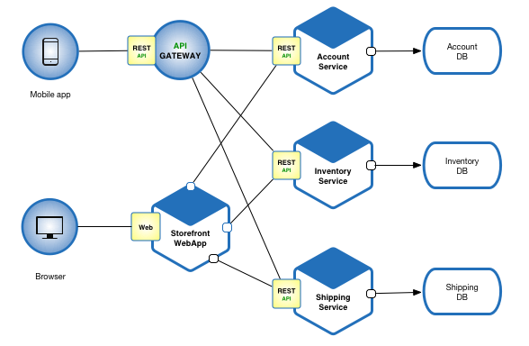
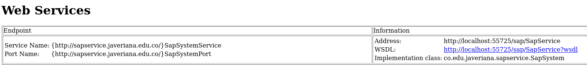
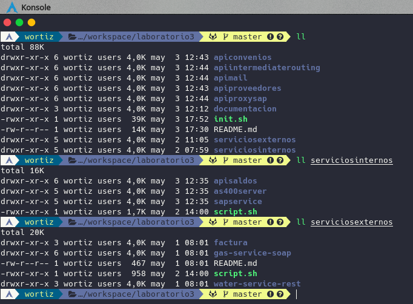

|  | <h1> PONTIFICIA UNIVERSIDAD JAVERIANA </h1> |
| :--: |  :--: |

## TALLE 1 MODELOS Y VALIDACIÓN

### EQUIPO 5 
El equipo 5 está conformado por:
  - *Jhon Edward Celemin Florez*
  - *Eduardo José Franco Rivera*
  - *Wilman Alberto Ortiz Navarro*
  - *Brian Camilo Suarez Botia*  

### TABLA DE CONTENIDO
---

1. [Descripcion del problema](#DESC-PROBLEMA)
2. [Arquitectura de la Solucion](#ARQ-SOL)
    1. [Justificación de la Arquitectura](#ARQ-SOL)
        1. [Microservicios](#ARQ-MICRO)
        2. [Docker](#DOCKER-MICRO)
        3. [Api Gateway](#GATEWAY-MICRO)
        4. [RabbitMQ](#RABBIT-MICRO)
        5. [Intermediate Routing](#ROUTING-MICRO)
        6. [Inventario de Microservicios](#INV-MICRO)
        7. [Patrones](#PATRONES-MICRO)
        8. [Estilos de los servicios](#ESTILOS-MICRO)
4. [Documentacion de Microservicios](#DOC-MICRO)
    1. [Servicio Consultar Saldos](#SERVICIO-SALDOS)
    2. [Servicio Consultar Usuario](#SERVICIO-USUARIO)
    3. [Servicio Gestión de Convenios](#SERVICIO-CONVENIO)
    4. [Servicio Gestión de Proveedores](#SERVICIO-PROVEEDORES)
    5. [Servicio Notificaciones](#SERVICIO-NOTIFICACIONES)
    6. [Servicio de Routing](#SERVICIO-ROUTING)
5. [Ejecución](#EJECUCION)
6. [Herramientas y Frameworks](#HERRAMIENTAS)


#### 1. Decripcion del problema <a name="DESC-PROBLEMA"></a>
---
El Banco ABC está realizando varios proyectos de actualización tecnológica los cuales le permiten ofrecer sus productos financieros de manera más ágil y de ésta forma responder a nuevas necesidades del mercado. 

El Banco acaba de firmar una alianza estratégica con diferentes proveedores de servicios públicos (Agua, Gas, Luz, Telefonía) o también llamados convenios, para permitir a los clientes del banco a través de los diferentes canales de servicio (Cajeros Automáticos, Cajero de Oficina, Teléfono, Portal Web, Aplicación Móvil) permitir el pago de los mismos. 

El proceso de vista al usuario se puede definir de la siguiente manera a través de las siguientes tareas:


Cada uno de los proveedores de servicios públicos ofrece los mecanismos de interacción tecnológica necesarios para que el Banco pueda ejecutar las acciones de pago.

Cada proveedor utiliza tecnologías diferentes para ofrecer sus servicios.

> ***El banco cuenta con un sistema SAP que ofrece varios servicios Web SOAP con los cuales se realiza la actual validación del usuario. La verificación de saldos en las cuentas se realiza a través de una interface de sockets a un aplicativo Java que se encuentra en un sistema AS/400.***

> ***El Banco ABC quiere tener la posibilidad de adicionar nuevos convenios con otros proveedores de servicios de manera ágil, o incluso la posibilidad de terminar/eliminar los convenios existentes sin que esto represente indisponibilidad del servicio.***

Se llegó a un acuerdo de las capacidades/primitivas básicas que se deben soportar para cada convenio:

    • Consulta de saldo a Pagar
    • Pago del Servicio
    • Compensación de pago (Opcional)

Sin embargo, el proveedor del servicio de Gas no soporta actualmente la capacidad de ‘Compensación de pago’. Puede que este proveedor la soporte en el futuro.

Para este tipo de situaciones, donde los proveedores no soportan la última opción, se debe generar un mensaje por correo electrónico dirigido al área de soporte de incidentes de Banco, para que ellos se hagan cargo.

Principalmente el banco necesita un conjunto de servicios que representen sus necesidades internas de negocio, lo cual les permite desacoplar los servicios de los proveedores y así no depender de sus detalles.

La definición de los servicios se encuentra [aqui](https://github.com/germansua/UJaveriana-AES-ModVal/tree/master/modval/workshops "Repositorio github servicios externos del banco")

#### 2. Arquitectura de solución <a name="ARQ-SOL"></a>
---


##### 2.1. Justificación de la Arquitectura <a name="ARQ_JUSTIFICACION"></a>

##### 1. MicroServicios <a name="ARQ-MICRO"></a>

> *Se utilizo para que el equipo trabajara en pequeños componentes y así poder terminar en el tiempo estimado para el desarrollo. Con esto las responsabilidades de cada integrante del equipo están mas definidas, ya que se definió componentes de la aplicación para cada uno. Esto permitió que cada uno se preocupara por cada microservicio y así no tener dependencias con los demás desarrollos.**

##### 2. Docker <a name="DOCKER-MICRO"></a>

> *Se utilizo para simplificar el proceso de desarrollo y despliegue de la aplicación, permitiendo el desarrollo de una manera más rápida y ágil, ya que cada miembro del equipo no tenia que depender de alguien en especifico para que tuviera las maquinas arriba para las pruebas.** 

##### 3. Api Gateway <a name="GATEWAY-MICRO"></a>

> *Se utilizo para apoyar la arquitectura de microservicios, se definió para proporcionar un punto central para el consumo de las diferentes apis dentro de la aplicación, va a ser el responsable de atender las diferentes solicitudes que lleguen a la aplicación y va a redireccionar el trafico a los diferentes servicios definidos.*


##### 4. RabbitMQ <a name="RABBIT-MICRO"></a>

> *Se utilizo para definir las colas que van a almacenar los mensajes que envían las apis de los diferentes servicios, estos van a estar esperando hasta que lleguen las peticiones de consumo. Permitiendo que los mensajes que envían las apis, se enruten al consumidor correcto. Esto ayudara a la integración de los diferentes componentes, sistemas internos y externos.*

##### 5. Intermediate Routing <a name="ROUTING-MICRO"></a>

> *Se utilizo para identificar los diferentes servicios de destino y poderlos enrutar dinámicamente, se basa en una base de datos la cual contiene todos los endpoint de los servicios de la aplicación, actúa como una regla de negocio la cual por el nombre del servicio identifica el servicio de destino, luego, por medio del rabbitMQ o Api Gateway se enruta hacia su destino.*

##### 6. Trade-Off <a name="TRADE-MICRO"></a>
> - Al dar simplicidad al desarrollo, se descuidó la seguridad de la aplicación
> - Permitir que el sistema sea escalable adicionando nuevos servicios, puede afectar en el performance de la aplicación.

##### 7. Patrones <a name="PATRONES-MICRO"></a>

Para la implementación de la arquitectura propuesta se tuvieron en cuenta los siguientes patrones:

  - Base de datos por servicio:
    
    
    
    
  *Referencia:  [Base de datos por servicio](https://microservices.io/patterns/data/database-per-service.html "Patrón de dase de datos por servicio")* 
  
  - Event Sourcing

  
  
  *Referencia: [Event sourcing](https://microservices.io/patterns/data/event-sourcing.html)*
    
  - Api Gateway
  
  
  
  *Referencia: [API gateway pattern](https://microservices.io/patterns/apigateway.html)*
  
  - Patrón Intermediate Routing
  
  

##### 8. Estilo de realización de los servicios <a name="ESTILOS-MICRO"></a>

Para el desarrollo de los servicios se planteo una estructura en capas para cada aplicación y de esta manera tener un control sobre su desarrollo:

  


#### 3. Inventario de Microervicios <a name="INV-MICRO"></a>
---

| Código | Versión | Nombre | Descripción | Endpoint |
|---|:-:|:-:|:-:|:-:|
| API_0001 | v1.0 | Consulta Saldos | Permite validar si hay saldo en la cuenta del cliente | http://localhost:52001/apisaldos/api/v1.0/saldos |
| API_0002 | v1.0 | Consulta Usuario SAP | Permite la validación de los usuarios | http://localhost:55725/sap/SapService |
| API_0003 | v1.0 | Consulta Servicio Facturas | Muestra los datos del servicio de facturas | http://localhost:9090/api/domiciliacion/factura?fid= |
| API_0004 | v1.0 | Consulta Servicio Agua | Muestra los datos del servicio de agua | http://localhost:9091/servicios/pagos/v1/payments/1 |
| API_0005 | v1.0 | Consulta Servicio Gas | Muestra los datos del servicio de gas | http://localhost:8080/gas-service/PagosService?wsdl |
| API_0006 | v1.0 | Api Convenios | Api con el CRUD para los proveedores | http://localhost:8060/apiproveedores/api/v1.0/proveedores |
| API_0007 | v1.0 | Api Intermediate Routing | Api para enrutar la invocación de servicios | http://localhost:8070/apirouting/api/v1.0/routing/{servicio}/servicio |
| API_0008 | v1.0 | Api Mail | Api para el envio de correos | http://localhost:8040/apimail/api/v1.0/email/Gas |
| API_0009 | v1.0 | Api gateway | Enrutamiento de servicios | http://localhost:8050/apiproxy/api/v1.0/proveedores |
| API_0010 | v1.0 | Api Proveedores | Api con el CRUD para los proveedores | http://localhost:8060/apiproveedores/api/v1.0/proveedores |

#### 4. Documentación de Microservicios <a name="DOC-MICRO"></a>
---

A continuación de detalla cada uno de los servicios que se crearon para la solución al problema propuesto adicional se describen sus operaciones con sus *Inputs/Outputs*, tener presente que se pueden consultar con *url* respectiva de cada servcio:

> *http://hostname:port/context/swagger-ui.html*

#### 4.1. Servicio *Consultar Saldos* <a name="SERVICIO-SALDOS"></a>


***Request***

```json
  http://localhost:52001/apisaldos/api/v1.0/saldos/{username}
```

***Response***

```json
  {
    "saldo": 1200000
  }
```

#### 4.2. Servicio *Consultar Usuario* <a name="SERVICIO-USUARIO"></a>




***Request***

```xml
  <soapenv:Envelope xmlns:soapenv="http://schemas.xmlsoap.org/soap/envelope/" xmlns:sap="http://sapservice.javeriana.edu.co/">
   <soapenv:Header/>
   <soapenv:Body>
      <sap:existeUsuario>
         <!--Optional:-->
         <arg0>cperez</arg0>
      </sap:existeUsuario>
   </soapenv:Body>
</soapenv:Envelope>
```

***Response***

```xml
  <S:Envelope xmlns:S="http://schemas.xmlsoap.org/soap/envelope/">
   <S:Body>
      <ns2:existeUsuarioResponse xmlns:ns2="http://sapservice.javeriana.edu.co/">
         <return>
            <cabecera>
               <code>0</code>
               <description>Usuario registrado</description>
               <type>OK</type>
            </cabecera>
            <usuario>
               <apellidos>Perez Rodriguez</apellidos>
               <code>1111</code>
               <direccion>Calle 123 # 123</direccion>
               <nombres>Carlos Andres</nombres>
               <telefono>951478</telefono>
               <username>cperez</username>
            </usuario>
         </return>
      </ns2:existeUsuarioResponse>
   </S:Body>
</S:Envelope>
```

#### 4.3. Servicio *Gestión de Convenios* <a name="SERVICIO-CONVENIO"></a>


- Consultar listado de convenios

*Request*

```json
  GET "http://localhost:7070/apiconvenios/api/v1.0/convenios"
```

*Response*

```json
  [
    {
      "idConvenio": 1,
      "nombre": "CONVENIO_PRUEBA",
      "descripcion": "pruebas",
      "fecha": "2020-05-03 17:43:50",
      "esActivo": true,
      "proveedor": 1
    }
  ]
```
- Crear convenio

*Request*

```json
  POST "http://localhost:7070/apiconvenios/api/v1.0/convenios
```

*Response*

```json
  {
    "descripcion": "string",
    "esActivo": true,
    "fecha": "2020-05-03T20:23:24.125Z",
    "idConvenio": 0,
    "nombre": "string",
    "proveedor": 0
  }
```
- Consultar convenios por *{id}*

*Request*

```json
  POST "http://localhost:7070/apiconvenios/api/v1.0/convenios/{id}
```

*Response*

```json
  {
    "idConvenio": 1,
    "nombre": "CONVENIO_PRUEBA",
    "descripcion": "pruebas",
    "fecha": "2020-05-03 17:43:50",
    "esActivo": true,
    "proveedor": 1
  }
```
- Actualizar información del convenio

*Request*

```json
  {
    "idConvenio": 1,
    "nombre": "CONVENIO_PRUEBA_2",
    "descripcion": "pruebas",
    "fecha": "2020-05-03 17:43:50",
    "esActivo": true,
    "proveedor": 1
  }
```

*Response*

```json
  {
    "idConvenio": 1,
    "nombre": "CONVENIO_PRUEBA_2",
    "descripcion": "pruebas",
    "fecha": "2020-05-03 17:43:50",
    "esActivo": true,
    "proveedor": 1
  }
```

- Eliminar convenios por *{id}*

*Request*

```json
  DELETE http://localhost:7070/apiconvenios/api/v1.0/convenios/{id}
```

*Response*

```json
  200
```  

#### 4.4. Servicio *Gestión de Proveedores* <a name="SERVICIO-PROVEEDORES"></a>


- Consultar listado de proveedores

*Request*

```json
  GET http://localhost:8060/apiproveedores/api/v1.0/proveedores
```  

*Response*

```json
[
  {
    "idProveedor": 1,
    "nombre": "PROVEEDOR_PRUEBA",
    "descripcion": "pruebas",
    "fecha": "2020-05-03 17:44:10",
    "esActivo": true,
    "esCompensacion": true
  }
]
``` 

- Crear proveedores de servicios

*Request*

```json
  GET http://localhost:8060/apiproveedores/api/v1.0/proveedores
```  

*Response*

```json
{
  "descripcion": "string",
  "esActivo": true,
  "esCompensacion": true,
  "fecha": "2020-05-03T21:57:07.816Z",
  "idProveedor": 0,
  "nombre": "string"
}
```

- Consultar proveedor por *{id}*

*Request*

```json
  GET http://localhost:8060/apiproveedores/api/v1.0/proveedores/{id}
```

*Response*

```json
{
  "descripcion": "string",
  "esActivo": true,
  "esCompensacion": true,
  "fecha": "2020-05-03T21:58:11.893Z",
  "idProveedor": 0,
  "nombre": "string"
}
```


- Actualizar información del proveedor por *{id}*

*Request*

```json
PUT http://localhost:8060/apiproveedores/api/v1.0/proveedores/{id}
  
{
  "descripcion": "string",
  "esActivo": true,
  "esCompensacion": true,
  "fecha": "2020-05-03T21:57:27.203Z",
  "idProveedor": 0,
  "nombre": "string"
}
```

*Response*

```json
{
  "descripcion": "string",
  "esActivo": true,
  "esCompensacion": true,
  "fecha": "2020-05-03T21:58:11.893Z",
  "idProveedor": 0,
  "nombre": "string"
}
```

- Eliminar información del proveedor por *{id}*
 
*Request*

```json
DELETE http://localhost:8060/apiproveedores/api/v1.0/proveedores/{id}
```

*Response*

```json
{
  "descripcion": "string",
  "esActivo": true,
  "esCompensacion": true,
  "fecha": "2020-05-03T22:02:18.752Z",
  "idProveedor": 0,
  "nombre": "string"
}
``` 

#### 4.5. Servicio *Notificaciones* <a name="SERVICIO-NOTIFICACIONES"></a>


- Enviar correo electronico

*Request*

```json
GET http://localhost:8040/apimail/api/v1.0/email/{servicio}
```

*Response*

```json
Http Code 200
```

#### 4.6. Servicio de *Routing* <a name="SERVICIO-ROUTING"></a>


- Crear registro del servicio a enrutar

*Request*

```json
{
  "endPoint": "string",
  "idServicio": 0,
  "nombreServicio": "string"
}
```

*Response*

```json
{
  "endPoint": "string",
  "idServicio": 0,
  "nombreServicio": "string"
}
```

- Consultar endpoint del servicio por *{id}*

*Request*

```json
GET http://localhost:8070/apirouting/api/v1.0/routing/{id}
```

*Response* 

```json
{
  "idServicio": 1,
  "endPoint": "http://localhost:52001/apisaldos/api/v1.0/saldos/",
  "nombreServicio": "SALDOS"
}
```

- Consultar nombre del servicio por nombre 

*Request* 

```json
GET http://localhost:8070/apirouting/api/v1.0/routing/{servicio}/servicio
```

*Response* 

```json
{
  "idServicio": 4,
  "endPoint": "http://localhost:9091/servicios/pagos/v1/payments/",
  "nombreServicio": "AGUA"
}
```

- Eliminar servicio registrado por *{id}* 

*Request*

```json
DELETE http://localhost:8070/apirouting/api/v1.0/routing/{id}
```

*Response* 

```json
{
  "endPoint": "string",
  "idServicio": 0,
  "nombreServicio": "string"
}
```

#### 5. Ejecución <a name="EJECUCION"></a>
---

Con el proposito de facilitar la ejecución de la solución se desarrolló un script bash de *Linux* para automatizar tanto la compilación de los projectos *Spring boot 2* como de las builds de las imagenes y la ejecución de los contenedores de cada base de datos y microservicio, para ello en la raíz de *laboratorio3* el script *init.sh* solo basta ejecutar la siguiente instrucción para tener todo el ambiente de la solucion funcionando y disponible:

> [user@developer-io laboratorio3]# *./init.sh*



una vez ejecutado el script podemos observar que ejecuta todas las instrucciones programas:


se puede observar el proceso de compilación:


y finalmente si todo ha ido bien la ejecucion ha sido exitosa!


#### 6. Herramientas y Frameworks <a name="HERRAMIENTAS"></a>
---

Para el desarrollo del presente taller se utilizaron las siguientes herramientas  y frameworks:

| Herramienta | Framework | Versión |
| :--: |  :--: |  :--: |
| IntelliJ |  | 2020.1.1 |
| MySQL WorkBench |  | 8.0.20 |
| Postman |  | 7.23.0 |
| Spring Initializr |  |  |
| Docker |  | 19.03.8-ce |
| Docker Compose |  | 1.25.5 | 
| MySQL Server |  | 8.0.2 |
| Git |  | 2.26.2 |
| GitLab |  | 13.0 |
|  | Java | 11.0.6 |
|  | Spring | 5.0 |
|  | Spring Boot | 2.2.6 |
|  | Swagger | 2.9.2 |
|  | MySQL Jdbc | 8.0.11 |
|  | Lombok | 1.18.2 |
|  | Maven | 3.6.3 | 